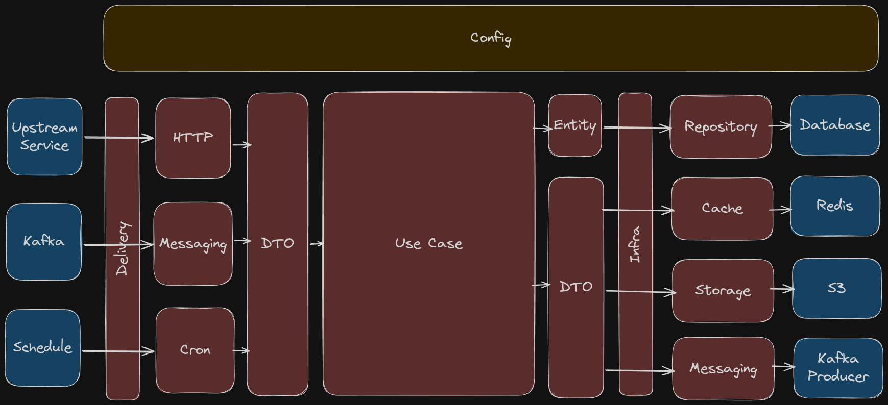

# Golang Clean Architecture Template

## Description

This is golang clean architecture template.

Fork from https://github.com/khannedy/golang-clean-architecture with this feature:

1. Better delivery return handling. See [example](internal/delivery/http/address_controller.go).
2. Better logging using middleware. See [usecase](internal/usecase/address/create.go) clean, logging in [usecase middleware log](internal/usecase/address/address_usecase_mw_logger.go).
3. Better error handling. See [errkit.BadRequest(err)](internal/usecase/address/create.go) will handled in [response.Error](internal/config/fiber.go).
4. Better error handling 2. See [errkit.AddFuncName](internal/usecase/address/create.go). Example response json:
```json
{
  "data": null,
  "error_message": "conflict",
  "error_detail": [
    "http.(*UserController).Register",
    "usecase.(*UserUsecaseImpl).Create",
    "[409] conflict",
    "user already exists"
  ]
}
```
5. Request has trace id. See [example](internal/delivery/http/middleware/trace_id_middleware.go).
6. Better searching log with trace id. Example log:
```json
{
    "err": "usecase.(*UserUsecaseImpl).Create:: [409] conflict:: user already exists",
    "fields": {
        "req": {
            "id": "joko",
            "password": "joko",
            "name": "Joko"
        },
        "res": null
    },
    "level": "error",
    "msg": "user.(*UserUsecaseMwLogger).Create",
    "time": "2025-09-21T18:20:59+07:00",
    "trace_id": "62dff97d-f0b5-4d88-89e6-3f78bed04c4e"
}
```
7. Swagger auto generated. See [example](internal/delivery/http/address_controller.go). See http://localhost:3000/swagger
8. Using interface make it easier to test. See [example](internal/usecase/address/address_usecase.go).
9. Command shortcut using [Makefile](Makefile).
10. Gateway rest api client. See [example](internal/gateway/rest/slack_client.go).
11. Simple repository without generic. See [example](internal/repository/user_repository.go).
12. Simple call kafka producer. See [u.AddressProducer.Send](internal/usecase/address/create.go).
13. Splitted usecase. See [example](internal/usecase/address).
14. Test will use container db. See [example](test/init_test.go).
15. Run application with docker container. See [Run Application](#run-application) & [docker-compose.yml](docker-compose.yml).


## Architecture



1. External system perform request (HTTP, gRPC, Messaging, etc)
2. The Delivery creates various Model from request data
3. The Delivery calls Use Case, and execute it using Model data
4. The Use Case create Entity data for the business logic
5. The Use Case calls Repository, and execute it using Entity data
6. The Repository use Entity data to perform database operation
7. The Repository perform database operation to the database
8. The Use Case create various Model for Gateway or from Entity data
9. The Use Case calls Gateway, and execute it using Model data
10. The Gateway using Model data to construct request to external system 
11. The Gateway perform request to external system (HTTP, gRPC, Messaging, etc)

## Tech Stack

- Golang : https://github.com/golang/go
- MySQL (Database) : https://github.com/mysql/mysql-server
- Apache Kafka : https://github.com/apache/kafka

## Framework & Library

- GoFiber (HTTP Framework) : https://github.com/gofiber/fiber
- GORM (ORM) : https://github.com/go-gorm/gorm
- Viper (Configuration) : https://github.com/spf13/viper
- Golang Migrate (Database Migration) : https://github.com/golang-migrate/migrate
- Go Playground Validator (Validation) : https://github.com/go-playground/validator
- Logrus (Logger) : https://github.com/sirupsen/logrus
- Sarama (Kafka Client) : https://github.com/IBM/sarama

## Configuration

All configuration is in `config.json` file.

## API Spec

All API Spec is in `api` folder. Auto generate with command `make swag`.

## Database Migration

All database migration is in `db/migrations` folder.

### Create Migration

```shell
migrate create -ext sql -dir db/migrations create_table_xxx
```

### Run Migration

```shell
make migrate
```

## Run Application

I recommend run with docker for testing.

1. Run docker compose.

```bash
make docker-compose
```

This will run docker compose that will run mysql & kafka. Go to http://localhost:8080/ to see kafka.

2. Keep docker container running. From another terminal, run migration and run application.

```bash
make migrate
```

This will run migration.

```bash
make run
```

This will run application. Go to swagger http://localhost:3000/swagger.
