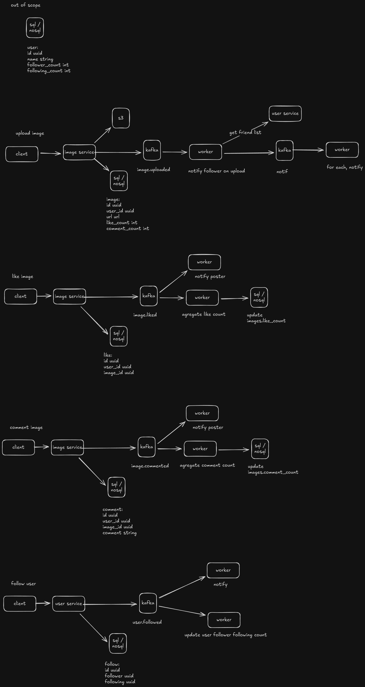

# Golang Clean Architecture Template

## Description

This is a Golang clean architecture template. It demonstrates how to run an HTTP server and Kafka consumers, while also providing examples of Kafka producers.

## Architecture


1. External system perform request (HTTP, gRPC, Messaging, etc)
2. The Delivery creates various Model from request data
3. The Delivery calls Use Case, and execute it using Model data
4. The Use Case create Entity data for the business logic
5. The Use Case calls Repository, and execute it using Entity data
6. The Repository use Entity data to perform database operation
7. The Repository perform database operation to the database
8. The Use Case create various Model for Gateway or from Entity data
9. The Use Case calls Gateway, and execute it using Model data
10. The Gateway using Model data to construct request to external system 
11. The Gateway perform request to external system (HTTP, gRPC, Messaging, etc)

## System Design & Features

This template implements a social media-like backend to demonstrate scalable system design patterns including event-driven architecture and asynchronous processing.



### Implemented Flows

1.  **Upload Image**
    *   **Flow:** Client uploads image -> Saved to S3 & DB -> `image.uploaded` event published to Kafka.
    *   **Async Processing:** Workers consume the event to notify followers (fetching friend lists from User Service) and trigger notification events.

2.  **Like Image**
    *   **Flow:** Client likes image -> Record saved to DB -> `image.liked` event published to Kafka.
    *   **Async Processing:**
        *   Worker notifies the image poster.
        *   Worker aggregates like counts and updates the `images` table asynchronously (eventual consistency).

3.  **Comment on Image**
    *   **Flow:** Client comments -> Record saved to DB -> `image.commented` event published to Kafka.
    *   **Async Processing:**
        *   Worker notifies the image poster.
        *   Worker aggregates comment counts and updates the `images` table.

4.  **Follow User**
    *   **Flow:** Client follows user -> Record saved to DB -> `user.followed` event published to Kafka.
    *   **Async Processing:**
        *   Worker notifies the followed user.
        *   Worker calculates and updates follower/following counts for involved users.

---

### 🚀 Key Features

1. **General**
   - **Better delivery return handling** — see [`return response.Data(ctx, http.StatusOK, res)`](internal/delivery/http/user_controller.go).
   - **Swagger auto generation** — see [example](internal/delivery/http/user_controller.go). Generate with `make swag`. Access: [http://localhost:3000/swagger](http://localhost:3000/swagger)
   - **Command shortcuts via Makefile** — see [Makefile](Makefile).
    - **Gateway REST API client** — example: [S3 client](internal/infra/storage/s3_client.go).
    - **Simplified repository (no generics)** — see [UserRepository](internal/infra/repository/user_repository.go).
   - **Simple Kafka producer call** — usage: [`u.UserProducer.SendUserFollowed`](internal/usecase/user/follow.go).
    - **Split usecase by domain** — example: [User usecase](internal/usecase/user).
    - **Run with Docker** — see [How To Run Application](#how-to-run-application).
    - **Typed configuration** — use [`config.Config`](internal/config/config.go) for type-safe access.

2. **Error Handling**
   - **Consistent error wrapping & mapping** — e.g. [`errkit.BadRequest(err)`](internal/usecase/user/create.go) handled by [`response.Error`](internal/config/fiber.go).
   - **Auto function-name enrichment** — [`errkit.AddFuncName`](internal/usecase/user/create.go).
   - **Example response:**
     ```json
     {
       "data": null,
       "error_message": "conflict",
       "error_detail": [
         "http.(*UserController).Register",
         "user.(*UserUsecaseImpl).Create",
         "[409] conflict",
         "user already exists"
       ]
     }
     ```

3. **Logging**
   - **Middleware-driven structured logging** — business logic stays clean; see [usecase](internal/usecase/user/create.go) and [usecase middleware logger](internal/usecase/user/user_usecase_mw_logger.go).
   - **Trace ID per request** — see [trace ID middleware](internal/delivery/http/middleware/trace_id_middleware.go).
   - **Trace-friendly logs** — sample:
     ```json
      {
          "err": "user.(*UserUsecaseImpl).Create:: [409] Conflict:: user already exists",
          "fields": {
              "req": {
                  "username": "manual-user-1731000000",
                  "password": "Passw0rd!",
                  "name": "Manual User 1731000000"
              },
              "res": null
          },
          "file": "/home/hidayat/data-d/myrepo/golang-clean-architecture/pkg/x/log_mw.go:20",
          "func": "github.com/Hidayathamir/golang-clean-architecture/pkg/x.LogMw",
          "level": "error",
          "msg": "user.(*UserUsecaseMwLogger).Create",
          "source": "/home/hidayat/data-d/myrepo/golang-clean-architecture/internal/usecase/user/user_usecase_mw_logger.go:35",
          "span_id": "9eac5661888eb4cd",
          "time": "2025-11-12T22:43:10+07:00",
          "trace_id": "b9de7b7454f39736ef4e5ca40c223541"
      }
     ```

4. **Testing**
     - **Interface-first design for easy mocking** — see [user usecase interface](internal/usecase/user/user_usecase.go). Generate mock with `make generate`.
     - **Unit test examples** — see [usecase/user tests](internal/usecase/user).

---

## Getting Started

### 1. Configuration

The application uses `config.json` for configuration. Ensure the values match your environment (e.g., database credentials, Kafka brokers, etc.).

### 2. Initial Setup

1. Check required tools:
```shell
make check-tools
```

2. Rename go module name:
```shell
make rename-go-mod
```

### 3. How To Run Application

Follow these steps to set up and run the entire ecosystem (Web, Worker, and Observability tools).

#### Start Infrastructure

Run the docker-compose to start Postgres, Kafka, SigNoz (Tracing), and AKHQ (Kafka UI).

```bash
make docker-compose
```

Wait until all containers are healthy. You can check the status using:
```bash
make docker-validate
```

#### Run Database Migrations

From a new terminal, run the migrations to set up your database schema.

```bash
make migrate
```

#### Run Application Servers

You usually need to run both the Web server (for APIs) and the Worker (for background jobs/Kafka consumers).

**Terminal A: Run Web Server**
```bash
make run
```
*   **Swagger UI**: [http://localhost:3000/swagger](http://localhost:3000/swagger)
*   **API Base URL**: `http://localhost:3000`

**Terminal B: Run Worker**
```bash
make run-worker
```
*   This handles async tasks like sending notifications or processing image uploads from Kafka topics.

### 3. Observability & Management Tools

Once everything is running, you can monitor the system using these tools:

| Tool | URL | Description |
| :--- | :--- | :--- |
| **SigNoz** | [http://localhost:3301](http://localhost:3301) | View distributed traces, logs, and application metrics. |
| **AKHQ** | [http://localhost:8080](http://localhost:8080) | Manage Kafka topics, consumers, and view messages in real-time. |
| **Swagger** | [http://localhost:3000/swagger](http://localhost:3000/swagger) | Interactive API documentation and testing. |

---

### Troubleshooting

*   **Port Conflicts**: Ensure ports `5432` (Postgres), `9093` (Kafka), `3301` (SigNoz), `8080` (AKHQ), and `3000` (Web App) are not in use by other services.
*   **Kafka Readiness**: If the worker fails to start, wait a few more seconds for Kafka to be fully ready even after the container shows "Up".
*   **Resetting Environment**: If you want to start fresh, run:
    ```bash
    make docker-compose # This will down -v (remove volumes) and up again
    ```

---

## Repository Guidelines

For contributor instructions and repository structure details, see [Repository Guidelines](GEMINI.md).