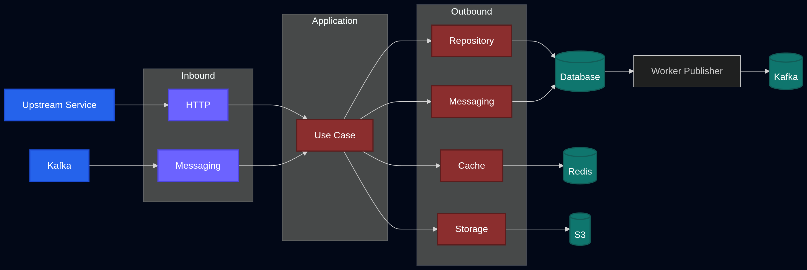

# Golang Clean Architecture Template

## Description

This is a Golang clean architecture template.

## Architecture



## Getting Started

### 1. Configuration

The application uses `config.json` for configuration.

### 2. How To Run Application

Follow these steps to set up and run the entire ecosystem (Web, Worker, and Observability tools).

#### Start Infrastructure

Run the docker-compose to start Postgres, Kafka, SigNoz (Tracing), and AKHQ (Kafka UI).

```bash
make docker-compose-up
```

Wait until all containers are healthy. You can check the status using:
```bash
make docker-validate
```

#### Run Database Migrations

From a new terminal, run the migrations to set up your database schema.

```bash
make migrate
```

#### Run Application Servers

Run both the Web server (for APIs) and the Worker (for background Kafka consumers).

**Terminal A: Run Web Server**
```bash
make run
```

The log can be seen in `logs/web_log.jsonl`

**Terminal B: Run Worker**
```bash
make run-worker
```
*   This handles async tasks like sending notifications or processing image uploads from Kafka topics.

The log can be seen in `logs/worker_log.jsonl`

### 3. Observability & Management Tools

Once everything is running, you can monitor the system using these tools:

| Tool | URL | Description |
| :--- | :--- | :--- |
| **SigNoz** | [http://localhost:3301](http://localhost:3301) | View distributed traces, logs, and application metrics. |
| **AKHQ** | [http://localhost:8080](http://localhost:8080) | Manage Kafka topics, consumers, and view messages in real-time. |
| **Swagger** | [http://localhost:3000/swagger](http://localhost:3000/swagger) | Interactive API documentation and testing. |
| **Kibana** | [http://localhost:5601](http://localhost:5601) | Explore, analyze, and visualize data stored in Elasticsearch |

---

## Repository Guidelines

For contributor instructions and repository structure details, see [Repository Guidelines](GEMINI.md).